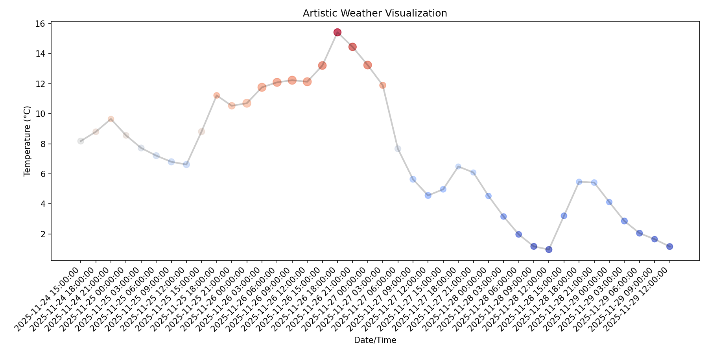

# Weather Art Visualization

This project collects weather data and transforms it into an artistic visualization using Python. The goal is to explore the boundary between data visualization and generative art.

## Features
- Fetches weather data from an online API
- Processes and cleans the data
- Creates a creative, artistic visualization (static or animated)

## How to Use
1. Install dependencies: `pip install -r requirements.txt`
2. Run the main script in `src/` to fetch data and generate the visualization

## Screenshot
The artistic visualization looks like this:



If you don't yet have the image file in the repository, save the attached screenshot as `assets/visualization.png` (create the `assets/` directory if it doesn't exist). On macOS you can save an image from the finder into that path or from the browser using "Save Image As...".

## Run instructions (recommended)
Follow these steps to create a reproducible environment and run the visualization exactly as I used it locally.

1. Create a virtual environment (macOS / Linux):

	```bash
	cd /path/to/weather-art
	python3 -m venv .venv
	source .venv/bin/activate
	```

2. Install dependencies:

	```bash
	pip install --upgrade pip setuptools wheel
	pip install -r requirements.txt
	```

3. Run the visualization script:

	```bash
	.venv/bin/python src/visualize_weather.py
	```

	This will open a matplotlib window with the artistic plot. If you prefer to save the plot to a file instead of opening a window, edit `src/visualize_weather.py` and replace `plt.show()` with `plt.savefig('assets/visualization.png', dpi=150)`.

4. Quick check that `matplotlib` is available in the active environment:

	```bash
	.venv/bin/python -c "import matplotlib; print(matplotlib.__version__)"
	```

Notes
- If VS Code is used, select the interpreter at `${workspaceFolder}/.venv/bin/python` (Command Palette → "Python: Select Interpreter").
- The repository README now references `assets/visualization.png`. If you prefer a different path or name, update the markdown image link accordingly.


## Project Structure
- `data/` — stores raw and processed data
- `src/` — source code for data collection, processing, and visualization
- `.github/` — project instructions and workflow

## License
MIT
